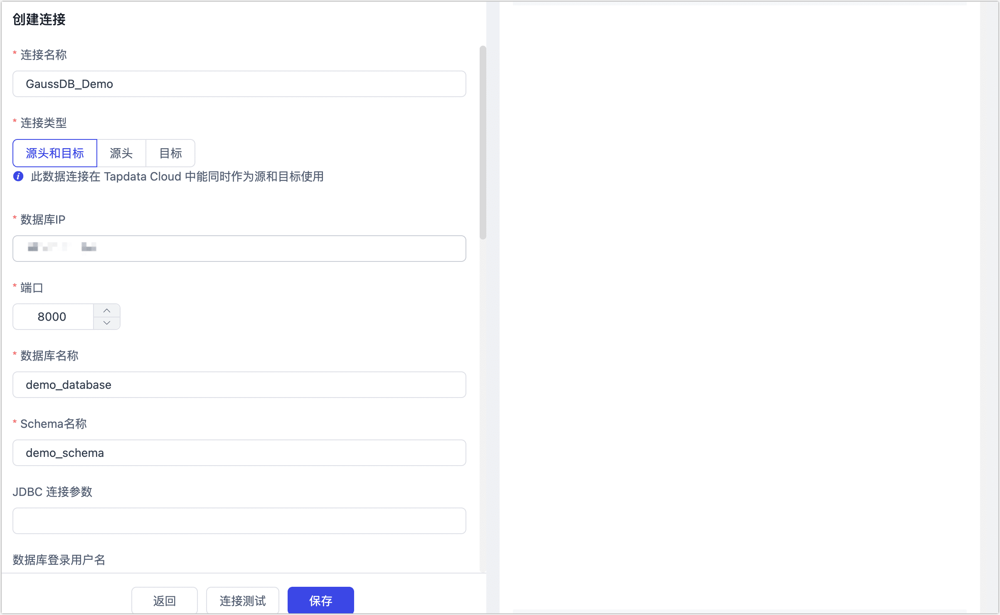

# Huawei Cloud GaussDB

import Content from '../../reuse-content/_enterprise-and-cloud-features.md';

<Content />

GaussDB 是华为自主创新研发的分布式关系型数据库，支持分布式事务，同城跨 AZ 部署，数据 0 丢失，支持 1000+ 的扩展能力，PB 级海量存储，可为企业提供功能全面，稳定可靠，扩展性强，性能优越的企业级数据库服务。TapData 支持将 GaussDB 作为源或目标数据库，帮助您快速构建数据流转链路。接下来，我们将介绍如何在 TapData 平台中连接 GaussDB 数据源。

```mdx-code-block
import Tabs from '@theme/Tabs';
import TabItem from '@theme/TabItem';
```

## 支持版本

华为云 GaussDB 企业版 2.8 版本（主备版）

:::tip

如您采用的是本地部署的 GaussDB，支持版本为 GaussDB Standby 8.1。

:::

## 增量同步说明

为实现增量数据的读取，TapData 需借助华为云 GaussDB  的[逻辑解码功能](https://support.huaweicloud.com/intl/zh-cn/centralized-devg-v2-gaussdb/devg_03_1324.html)，提取提交到事务日志中的更改以解析数据变化，限制如下：

- 支持解码的数据类型为：BIGINT、BIGSERIAL、CHAR(n)、DATE、DOUBLE PRECISION、FLOAT、INTEGER、SERIAL、SMALLINT、SMALLSERIAL、TEXT、TIME[WITHOUT TIME ZONE]、TIMESTAMP[WITHOUT TIME ZONE]、TINYINT、VARCHAR(n)
- 单条元组大小不超过 1 GB，考虑解码结果可能大于插入数据，因此建议单条元组大小不超过 500 MB
- 为解析某个 [Astore 表](https://support.huaweicloud.com/intl/zh-cn/fg-gaussdb-cent/gaussdb-48-0126.html)的 UPDATE 和 DELETE 语句，需为此表配置 [REPLICA IDENITY](https://support.huaweicloud.com/intl/zh-cn/centralized-devg-v2-gaussdb/devg_03_0520.html#ZH-CN_TOPIC_0000001496777341__li0149195395816) 属性，如果此表没有主键则需要配置为 FULL
- 不支持解码 DDL 语句，在执行特定的 DDL 语句（如普通表truncate或分区表exchange）时，可能造成解码数据丢失。此外，在事务中执行 DDL 语句后，该 DDL 语句与之后的语句不会被解码。
- 不支持 interval partition 表复制。
- 不支持<span id="prerequisites">全局临时表</span>。

## 准备工作

1. 访问华为云 GaussDB，[创建数据库用户并授予权限](https://support.huaweicloud.com/intl/zh-cn/distributed-devg-v8-gaussdb/gaussdb-12-0022.html)。

```mdx-code-block
<Tabs className="unique-tabs">
<TabItem value="作为源库">
```

* **全量同步**：DATABASE 的 CONNECT 权限、SCHEMA 的 USAGE 权限、表的 SELECT 或 UPDATE 权限（无主键表锁表需要 UPDATE 权限）、SEQUENCE 的 SELECT 权限
* **全量+增量同步**：REPLICATION 权限或继承了内置角色 gs_role_replication 的权限、DATABASE 的 CONNECT 权限、SCHEMA 的 USAGE 权限、表的 SELECT 或 UPDATE 权限（无主键表锁表需要 UPDATE 权限）、SEQUENCE 的 SELECT 权限。

</TabItem>

<TabItem value="作为目标库">

- **库级权限**：需要使用 root 或其他有 Sysadmin 角色的 DATABASE 用户登录 postgres 基库，赋予用户 DATABASE 的 CREATE、CONNECT 权限，授权示例：`GRANT CREATE, CONNECT ON DATABASE <database> TO <user>;`
- **SCHEMA 级权限**：需要使用 root、或其他有 Sysadmin 角色的 DATABASE 用户、或使用数据库的 OWNER 用户登录数据库，赋予用户 SCHEMA 的 CREATE、USAGE 权限，授权示例：`GRANT CREATE, USAGE ON SCHEMA <schema> TO <user>;`
- **表级权限**：需要使用 root、或其他有 Sysadmin 角色的 DATABASE 用户、或使用数据库的 OWNER 用户登录数据库 ，赋予用户 SCHEMA 下表的 DML 相关权限（SELECT 权限在处理无主键表时需要）。授权示例：`GRANT SELECT, UPDATE, INSERT, DELETE, INDEX, ALTER ON ALL TABLES IN SCHEMA <schema> TO <user>;`

</TabItem>
</Tabs>

2. 调整 `pg_hba.conf` 配置以允许访问数据库，需替换为实际的 IP 地址和用户名。下述案例中，允许 IP 地址为 10.10.10.10 的所有用户访问数据库。

   ```bash
   # IP 地址也可以设置为 0.0.0.0/0，即允许所有 IP
   host all all 10.10.10.10/32 sha256
   
   # 仅增量数据同步需配置下述信息
   host replication all 10.10.10.10/32 sha256
   ```

3. 如需增量数据同步，您还需要设置下述 GUC 参数调整，更多介绍，见[重设参数](https://support.huaweicloud.com/intl/zh-cn/centralized-devg-v2-gaussdb/devg_03_0355.html)。

   * **wal_level**：取值为 **logical**，即开启逻辑复制功能。
   * **max_replication_slots**：大于等于每个节点所需的（物理流复制槽数+备份槽数+逻辑复制槽数），默认为 20，建议参考值设置为使用此连接作为源的的任务任务数+1。
   
   

## 连接 GaussDB

1. [登录 TapData 平台](../../user-guide/log-in.md)。

2. 在左侧导航栏，单击**连接管理**。

3. 单击页面右侧的**创建**。

4. 在弹出的对话框中，搜索并选择 **GaussDB**。

5. 根据下述说明完成数据源配置。

   

   * **基础设置**

     * **连接名称**：填写具有业务意义的独有名称。
     * **连接类型**：支持将 GaussDB 作为源或目标库。
     * **数据库 IP**：填写 GaussDB 的连接地址，如果是通过公网连接，还需要[绑定弹性公网 IP](https://support.huaweicloud.com/intl/zh-cn/usermanual-gaussdb/gaussdb_01_160.html)。
     * **端口**：填写 GaussDB 的服务端口，例如 **8000**。
     * **数据库名称**：数据库名称，即一个连接对应一个数据库，如有多个数据库则需创建多个数据连接。
     * **Schema 名称**：即模式名称，一个数据库包含一个或多个 Schema，而每个 Schema 则包含表和其他类型的对象。
     * **JDBC 连接参数**：额外的连接参数，默认为空。
     * **用户名**、**密码**：分别填写登录 GaussDB 的账号和密码，具体权限要求，见[准备工作](#prerequisites)。
     * **逻辑复制 IP**、**逻辑复制端口**：分别填写主 DN 的 IP 地址，端口默认为 **8001**。
     * **日志插件**：保持默认的 **mppdb_decoding**。
     * **时区**：默认为数据库所用的时区，您也可以根据业务需求手动指定。

   * **高级设置**

     * **共享挖掘**：[挖掘源库](../../user-guide/advanced-settings/share-mining.md)的增量日志，可为多个任务共享源库的增量日志，避免重复读取，从而最大程度上减轻增量同步对源库的压力，开启该功能后还需要选择一个外存用来存储增量日志信息。

     * **包含表**：默认为**全部**，您也可以选择自定义并填写包含的表，多个表之间用英文逗号（,）分隔。

     * **排除表**：打开该开关后，可以设定要排除的表，多个表之间用英文逗号（,）分隔。

     * **Agent 设置**：默认为**平台自动分配**，您也可以手动指定 Agent。

     * **模型加载时间**：当数据源中模型数量小于 10,000 时，每小时刷新一次模型信息；如果模型数据超过 10,000，则每天按照您指定的时间刷新模型信息。

     * **开启心跳表**：当连接类型选择为**源头和目标**、**源头**时，支持打开该开关，由 Tapdata 在源库中创建一个名为 **_tapdata_heartbeat_table** 的心跳表并每隔 10 秒更新一次其中的数据（数据库账号需具备相关权限），用于数据源连接与任务的健康度监测。

       :::tip

       数据源需在数据复制/开发任务引用并启动后，心跳任务任务才会启动，此时您可以再次进入该数据源的编辑页面，即可单击**查看心跳任务**。

       :::

   * **SSL 设置**：选择是否开启 SSL 连接数据源，可进一步提升数据安全性，开启该功能后还需要上传 CA 文件、客户端证书、密钥填写客户端密码，可从 GaussDB 实例的**基本信息**中的**数据库信息**处下载相关信息。

6. 单击**连接测试**，测试通过后单击**保存**。

   :::tip

   如提示连接测试失败，请根据页面提示进行修复。

   :::