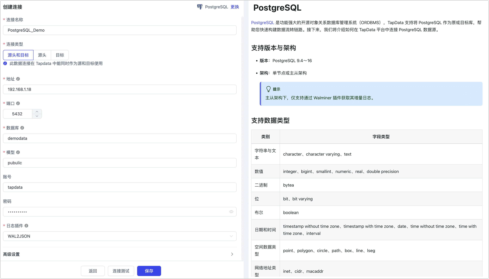
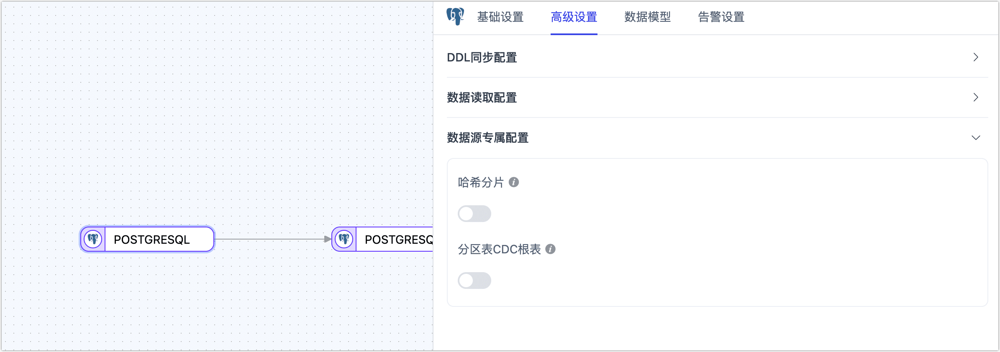

# PostgreSQL
import Content from '../../reuse-content/_all-features.md';

<Content />

[PostgreSQL](https://www.postgresql.org/) 是功能强大的开源对象关系数据库管理系统（ORDBMS），TapData 支持将 PostgreSQL 作为原或目标库，帮助您快速构建数据流转链路。接下来，我们将介绍如何在 TapData 平台中连接 PostgreSQL 数据源。

```mdx-code-block
import Tabs from '@theme/Tabs';
import TabItem from '@theme/TabItem';
```

## 支持版本与架构

* **版本**：PostgreSQL 9.4～16
* **架构**：单节点或主从架构
  :::tip
  主从架构下，如需读取从库的增量数据变更，需在配置数据源时选择 Walminer 插件来实现。
  :::

## 支持数据类型

| 类别         | 字段类型                                                     |
| ------------ | ------------------------------------------------------------ |
| 字符串与文本 | character、character varying、text                           |
| 数值         | integer、bigint、smallint、numeric、real、double precision   |
| 二进制       | bytea                                                        |
| 位           | bit、bit varying                                             |
| 布尔         | boolean                                                      |
| 日期和时间   | timestamp without time zone、timestamp with time zone、date、time without time zone、time with time zone、interval |
| 空间数据类型 | point、polygon、circle、path、box、line、lseg                |
| 网络地址类型 | inet、cidr、macaddr                                          |
| 标识符类型   | uuid、oid、regproc、regprocedure、regoper、regoperator、regclass、regtype、regconfig、regdictionary |
| 文本搜索类型 | tsvector、tsquery                                            |
| 其他         | xml、json、array                                             |

:::tip

将 PostgreSQL 作为目标库或通过 Wal2json 插件获取其增量数据时，以下数据类型不受支持：`tsvector`、`tsquery`、`regproc`、`regprocedure`、`regoper`、`regoperator`、`regclass`、`regtype`、`regconfig` 和 `regdictionary`。如果使用 Walminer 插件，这些类型同样不受支持，此外还包括 `array` 和 `oid` 类型。

:::

## 支持同步的操作

**INSERT**、**UPDATE**、**DELETE**

:::tip

作为同步目标时，您可以通过任务节点的高级配置选择写入策略，如插入冲突时更新或丢弃，更新失败时插入或仅打印日志。此外，还可应用和执行源库解析的 ADD COLUMN、CHANGE COLUMN、DROP COLUMN 和 RENAME COLUMN 操作。

:::

## 功能限制

- PostgreSQL 作为源库时，不支持采集其 DDL（如增加字段），且不支持指定增量数据采集时间。
- PostgreSQL 不支持字符串类型存放`\0`，TapData 会将其自动过滤以避免异常报错。
- 如需捕获分区主表的增量事件，必须使用 PostgreSQL 13 及以上版本，并选择 pgoutput 插件。
- Walminer 插件目前仅支持连接合并共享挖掘

## 注意事项

- 使用基于复制槽的日志插件（如 **wal2json**）时，过多的共享挖掘进程可能导致 WAL 日志积压，增加磁盘压力。建议减少挖掘进程数量或及时删除无用的 CDC 任务和复制槽。
- 基于 WAL 日志的插件（如 **walminer**）在执行共享挖掘时会频繁读写 `walminer_contents` 表，从而产生一定负载，但因目前仅支持单任务挖掘，影响相对较小。

## 准备工作

### 作为源库

1. 以管理员身份登录 PostgreSQL 数据库。

2. 创建用户并授权。

   1. 执行下述格式的命令，创建用于数据同步/开发任务的账号。

      ```sql
      CREATE USER username WITH PASSWORD 'password';
      ```

      * **username**：用户名。
      * **password**：密码。

   2. 执行下述格式的命令，授予账号权限。

      ```mdx-code-block
      <Tabs className="unique-tabs">
      <TabItem value="仅读取全量数据">
      ```
      
      ```sql
      -- 进入要授权的数据库
      \c database_name
      
      -- 授予目标 Schema 的表读取权限
      GRANT SELECT ON ALL TABLES IN SCHEMA schema_name TO username;
      
      -- Grant USAGE permission to schema
      GRANT USAGE ON SCHEMA schema_name TO username;
      ```
      </TabItem>
      
      <TabItem value="读取全量+增量数据">
      
      ```sql
      -- 进入要授权的数据库
      \c database_name
      
      -- 授予目标 Schema 的表读取权限
      GRANT SELECT ON ALL TABLES IN SCHEMA schema_name TO username;
      
      -- 授予目标 Schema 的 USAGE 权限
      GRANT USAGE ON SCHEMA schema_name TO username;
      
      -- 授予复制权限
      ALTER USER username REPLICATION;
      ```
      </TabItem>
      </Tabs>
      
      * **database_name**：数据库名称。
      * **schema_name**：Schema 名称。
      * **username**：用户名。

3. <span id="prerequisites">执行下述</span>格式的命令，修改复制标识为 FULL（使用整行作为标识），该属性决定了当数据发生 UPDATE/DELETE 时，日志记录的字段。

   :::tip

   如仅需读取 PostgreSQL 的全量数据，则无需本步骤及后续步骤。

   :::

   ```sql
   ALTER TABLE 'schema_name'.'table_name' REPLICA IDENTITY FULL;   
   ```

   * **schema_name**：Schema 名称。
   * **table_name**：表名称。

4. 登录 PostgreSQL 所属的服务器，根据业务需求和版本选择要安装的解码器插件：

   - [Wal2json](https://github.com/eulerto/wal2json/blob/master/README.md)（推荐）：适用于 PostgreSQL 9.4 及以上，将 WAL 日志转换为 JSON 格式，操作简单，需要源表包含主键，否则无法同步删除操作。
   - [Pgoutput](https://www.postgresql.org/docs/15/sql-createsubscription.html)：PostgreSQL 10 引入的内置逻辑复制协议，无需额外安装。对于含主键表且 `replica identity` 设置为 `default` 的情况，更新事件中的 `before` 会为空，可以通过设置 `replica identity full` 解决。
   - [Decoderbufs](https://github.com/debezium/postgres-decoderbufs)：适用于 PostgreSQL 9.6 及以上，利用 Google Protocol Buffers 解析 WAL 日志，但配置较为复杂。
   - [Walminer](https://gitee.com/movead/XLogMiner/tree/master/)：不依赖逻辑复制，无需设置 `wal_level` 为 `logical`，也不需要调整复制槽配置，但需授予超级管理员权限。

   接下来，我们以 **Wal2json** 为例演示安装流程。

   :::tip

   本案例中，PostgreSQL 为 12 版本，安装在 CentOS 7 操作系统上，如您的环境与本案例不同，需要调整下述步骤中安装的开发包版本、环境变量的路径等。

   :::

   1. 添加仓库包。

      ```bash
      yum install https://download.postgresql.org/pub/repos/yum/reporpms/EL-7-x86_64/pgdg-redhat-repo-latest.noarch.rpm
      ```

   2. 安装 PostgreSQL 12 开发包。

      ```bash
      yum install -y postgresql12-devel
      ```

   3. 设置环境变量并使其生效。

      ```bash
      export PATH=$PATH:/usr/pgsql-12/bin
      source /etc/profile
      ```

   4. 安装环境依赖，包含 llvm、clang、gcc 等。

      ```bash
      yum install -y devtoolset-7-llvm centos-release-scl devtoolset-7-gcc* llvm5.0
      ```

   5. 依次执行下述命令，完成插件的安装。

      ```bash
      # 克隆并进入目录
      git clone https://github.com/eulerto/wal2json.git && cd wal2json
      
      # 进入 scl 的 devtoolset 环境
      scl enable devtoolset-7 bash
      
      # 编译安装
      make && make install
      ```

   6. 修改配置文件 `postgresql.conf` ，将 `wal_level` 的值修改为 `logical`。

      :::tip

      如果 PostgreSQL 的版本为 9.4, 9.5、9.6，还需调大 `max_replication_slots` 和 `max_wal_senders` 的值（例如设置为 10）。

      :::

   7. 修改配置文件 `pg_hba.conf` ，增加下述内容以保障 TapData 可访问到数据库。

      ```bash
      # 替换 username 为前面创建的用户名
      local   replication     username                     trust
      host    replication     username  0.0.0.0/32         md5
      host    replication     username  ::1/128            trust
      ```

   8. 在业务低峰期，重启 PostgreSQL 服务。

      ```sql
      service postgresql-12.service restart
      ```

5. （可选）测试日志插件。

   1. 连接 postgres 数据库，切换至需要同步的数据库并创建一张测试表。

      ```sql
      -- 假设需要同步的数据库为 demodata，模型为 public
      \c demodata
      
      CREATE TABLE public.test_decode
      (
        uid    integer not null
            constraint users_pk
                primary key,
        name   varchar(50),
        age    integer,
        score  decimal
      );
      ```

   2. 创建 Slot 连接，以 wal2json 插件为例。

      ```sql
      SELECT * FROM pg_create_logical_replication_slot('slot_test', 'wal2json');
      ```

   3. 对测试表插入一条数据。

      ```sql
      INSERT INTO public.test_decode (uid, name, age, score)
      VALUES (1, 'Jack', 18, 89);
      ```

   4. 监听日志并查看返回结果，是否有刚才插入操作的信息。

      ```sql
      SELECT * FROM pg_logical_slot_peek_changes('slot_test', null, null);
      ```

      返回示例如下（竖向显示）：

      ```sql
      lsn  | 0/3E38E60
      xid  | 610
      data | {"change":[{"kind":"insert","schema":"public","table":"test_decode","columnnames":["uid","name","age","score"],"columntypes":["integer","character varying(50)","integer","numeric"],"columnvalues":[1,"Jack",18,89]}]}
      ```

   5. 确认无问题后，可销毁 Slot 连接并删除测试表。

      ```sql
      SELECT * FROM pg_drop_replication_slot('slot_test');
      DROP TABLE public.test_decode;
      ```

6. （可选）如需使用最后更新时间戳的方式进行增量同步，您需要执行下述步骤。

   1. 在源数据库中，执行下述命令创建公共函数，需替换 schema 名称。

      ```sql
      CREATE OR REPLACE FUNCTION schema_name.update_lastmodified_column()
        RETURNS TRIGGER LANGUAGE plpgsql AS $$
        BEGIN
            NEW.last_update = now();
            RETURN NEW;
        END;
      $$;
      ```

   2. 创建字段和 trigger，每个表均需执行一次，例如表名为 **mytable**。

      ```sql
      // 创建 last_update 字段
      ALTER TABLE schema_name.mytable ADD COLUMN last_udpate timestamp DEFAULT now();
      
      // 创建 trigger
      CREATE TRIGGER trg_uptime BEFORE UPDATE ON schema_name.mytable FOR EACH ROW EXECUTE PROCEDURE
        update_lastmodified_column();
      ```


### 作为目标库

1. 以管理员身份登录 PostgreSQL 数据库。

2. 执行下述格式的命令，创建用于数据同步/开发任务的账号。

   ```sql
   CREATE USER username WITH PASSWORD 'password';
   ```

   * **username**：用户名。
   * **password**：密码。

3. 执行下述格式的命令，为数据库账号授予权限。

   ```sql
   -- 进入要授权的数据库
   \c database_name;
   
   -- 授予目标 Schema 的 USAGE 和 CREATE 权限
   GRANT CREATE,USAGE ON SCHEMA schemaname TO username;
   
   -- 授予目标 Schema 的表读写权限
   GRANT SELECT,INSERT,UPDATE,DELETE,TRUNCATE ON ALL TABLES IN SCHEMA schemaname TO username;
   
	-- 授予目标 Schema 的 USAGE 权限
   GRANT USAGE ON SCHEMA schema_name TO username;
   
   -- 由于 PostgreSQL 自身限制，对于无主键表需要执行下面命令才可正常使用更新和删除（TapData 会自动执行）
	ALTER TABLE schema_name.table_name REPLICA IDENTITY FULL; 
	```
	
	* **database_name**：数据库名称。
	* **schema_name**：Schema 名称。
	* **username**：用户名。
	

### <span id="enable-ssl">开启 SSL 连接（可选）</span>

为进一步提升数据链路的安全性，您还可以选择为 PostgreSQL 数据库开启 SSL（Secure Sockets Layer）加密，实现在传输层对网络连接的加密，在提升通信数据安全性的同时，保证数据的完整性。

1. 登录 PostgreSQL 数据库所属的设备，依次执行下述命令创建自签名证书。

   ```bash
   # 生成根证书私钥（ pem文件）
   openssl genrsa -out ca.key 2048
   
   # 生成根证书签发申请文件（csr 文件）
   openssl req -new -key ca.key -out ca.csr -subj "/C=CN/ST=myprovince/L=mycity/O=myorganization/OU=mygroup/CN=myCA"
   
   # 创建自签发根证书，有效期为一年：
   openssl x509 -req -days 365 -extensions v3_ca -signkey ca.key -in ca.csr -out ca.crt
   ```

2. 依次执行下述命令，生成服务端私钥和证书。

   ```bash
   # 生成服务端私钥
   openssl genrsa -out server.key 2048
   
   # 生成服务端证书请求文件
   openssl req -new -key server.key -out server.csr -subj "/C=CN/ST=myprovince/L=mycity/O=myorganization/OU=mygroup/CN=myServer"
   
   # 使用自签 CA 证书签发服务端证书，有效期为一年
   openssl x509 -req -days 365 -extensions v3_req -CA ca.crt -CAkey ca.key -CAcreateserial -in server.csr -out server.crt
   ```

3. （可选）执行 `openssl verify -CAfile ca.crt server.crt` 命令，验证服务端证书是否正确签署。

4. 依次执行下述命令，生成客户端私钥和证书。

   ```bash
   # 生成客户端私钥
   openssl genrsa -out client.key 2048
   
   # 生成证书请求文件 ,为user1生成（完整认证时需要关注用户）
   openssl req -new -key client.key -out client.csr -subj "/C=CN/ST=myprovince/L=mycity/O=myorganization/OU=mygroup/CN=user1"
   
   # 使用根证书签发客户端证书
   openssl x509 -req -days 365 -extensions v3_req -CA ca.crt -CAkey ca.key -CAcreateserial -in client.csr -out client.crt
   ```

5. （可选）执行 `openssl verify -CAfile ca.crt client.crt` 命令，验证客户端证书是否正确签署。

6. 修改下述 PostgreSQL 配置文件，增加配置以启用 SSL 并指定相关证书/密钥文件。

   ```mdx-code-block
   <Tabs className="unique-tabs">
   <TabItem value="postgresql.conf">
   ```
   ```sql
   ssl = on
   ssl_ca_file = 'ca.crt'
   ssl_cert_file = 'server.crt'
   ssl_crl_file = ''
   ssl_key_file = 'server.key'
   ssl_ciphers = 'HIGH:MEDIUM:+3DES:!aNULL' # allowed SSL ciphers
   ssl_prefer_server_ciphers = on
   ```
   </TabItem>

   <TabItem value="pg_hba.conf">

   ```sql
   hostssl all all all trust clientcert=verify-ca
   ```
   </TabItem>
   </Tabs>

   


## 添加数据源
1. [登录 TapData 平台](../../user-guide/log-in.md)。

2. 在左侧导航栏，单击**连接管理**。

3. 单击页面右侧的**创建**。

4. 在弹出的对话框中，搜索并选择 **PostgreSQL**。

5. 在跳转到的页面，根据下述说明填写 PostgreSQL 的连接信息。

   

   * **连接信息设置**
      * **连接名称**：填写具有业务意义的独有名称。
      * **连接类型**：支持将 PostgreSQL 作为源或目标库。
      * **地址**：数据库连接地址。
      * **端口**：数据库的服务端口。
      * **数据库**：数据库名称，即一个连接对应一个数据库，如有多个数据库则需创建多个数据连接。
      * **模型**：Schema 名称。
      * **账号**：数据库的账号。
      * **密码**：数据库账号对应的密码。
      * **日志插件**：如需读取 PostgreSQL 的数据变更，实现增量数据同步，您需要根据[准备工作](#prerequisites)的指引，完成插件的选择和安装。
   * **高级设置**
      * **额外参数**：额外的连接参数，默认为空。
      * **时区**：默认为 0 时区，如果更改为其他时区，不带时区的字段（如 TIMESTAMP）会受到影响，而带时区的字段（如 TIMESTAMP WITH TIME ZONE）和 DATE 类型则不会受到影响。
      * **共享挖掘**：[挖掘源库](../../user-guide/advanced-settings/share-mining.md)的增量日志，可为多个任务共享源库的增量日志，避免重复读取，从而最大程度上减轻增量同步对源库的压力，开启该功能后还需要选择一个外存用来存储增量日志信息。
      * **包含表**：默认为**全部**，您也可以选择自定义并填写包含的表，多个表之间用英文逗号（,）分隔。
      * **排除表**：打开该开关后，可以设定要排除的表，多个表之间用英文逗号（,）分隔。
      * **Agent 设置**：默认为**平台自动分配**，您也可以手动指定 Agent。
      * **模型加载时间**：如果数据源中的模型数量少于10000个，则每小时更新一次模型信息。但如果模型数量超过10000个，则刷新将在您指定的时间每天进行。
      * **开启心跳表**：当连接类型选择为**源头和目标**、**源头**时，支持打开该开关，任务引用并该数据源并启动后，由 TapData 在源库中创建一个名为 **_tapdata_heartbeat_table** 的心跳表并每隔 10 秒更新一次其中的数据（数据库账号需具备相关权限），用于数据源连接与任务的健康度监测。
   * **SSL 设置**：选择是否[开启 SSL](#enable-ssl) 连接数据源，可进一步提升数据安全性，开启该功能后还需要上传 CA 文件、客户端证书、密钥填写客户端密码。

6. 单击**连接测试**，测试通过后单击**保存**。

   :::tip

   如提示连接测试失败，请根据页面提示进行修复。

   :::

## 节点高级特性

在配置数据同步/转换任务时，将 PostgreSQL 作为源或目标节点时，为更好满足业务复杂需求，最大化发挥性能，TapData 为其内置更多高级特性能力，您可以基于业务需求配置：



* 作为源节点
  * **哈希分片**：开启后，全表数据将在全量同步阶段按哈希值拆分为多个分片，并发读取数据，显著提升读取性能，但也会增加数据库负载，最大分片数可在启用开关后手动设置。
  * **分区表 CDC 根表**：仅在 PostgreSQL 13 及以上版本，并选择 pgoutput 日志插件时支持配置。开启时，仅感知根表的 CDC 事件；关闭时，仅感知子表的 CDC 事件。
* 作为目标节点
  * **忽略 NotNull**：默认关闭，即在目标库建表时忽略 NOT NULL 的限制。

## 常见问题

* 问：为什么 PostgreSQL 作为数据源的任务，重置会提示失败？

  答：任务在重置或删除时，TapData 需要清理数据库中逻辑复制的 SLOT，如果此时 PostgreSQL 库无法连接，可能会重置失败。

* 问TapData 任务运行后，PostgreSQL 中出现了很多 SLOT，这些可以清理吗？

  答：每个任务使用基于复制槽的日志插件时，如果暂时停止任务，会在 PostgreSQL 中留下一个 SLOT。如果清理这些 SLOT，可能会导致任务重启时丢失 offset，从而数据不完整。如果任务不再需要，可以重置或删除任务，以便及时清理 SLOT。此外，如果使用其他基于复制槽的同步工具，可能会出现复制槽无法被清理的情况，需要手动处理。

* 问题：当 CDC 意外中断后，可能导致 SLOT 连接无法从 PostgreSQL 主节点删除，如何清理？

  答：可登录主节点，删除相关 SLOT 避免一直占用，清理方式如下：

  ```sql
  -- 查看是否有 slot_name=tapdata 的信息
  TABLE pg_replication_slots;
  
  -- 删除 Slot 节点
  select * from pg_drop_replication_slot('tapdata');
  ```

