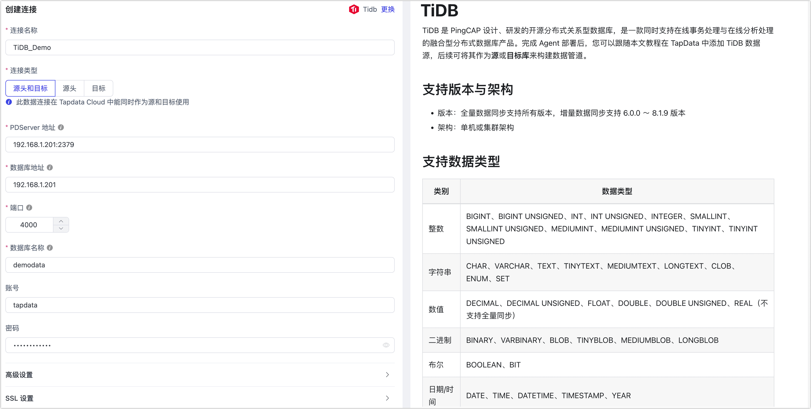

# TiDB
import Content from '../../reuse-content/_all-features.md';

<Content />

[TiDB](https://docs.pingcap.com/zh/tidb/stable) 是 PingCAP 设计、研发的开源分布式关系型数据库，是一款同时支持在线事务处理与在线分析处理的融合型分布式数据库产品。完成 Agent 部署后，您可以跟随本文教程在 TapData 中添加 TiDB 数据源，后续可将其作为**源**或**目标库**来构建数据管道。

```mdx-code-block
import Tabs from '@theme/Tabs';
import TabItem from '@theme/TabItem';
```

## 支持版本与架构

* 版本：全量数据同步支持所有版本，增量数据同步支持 6.0.0 ～ 8.1.9 版本
* 架构：单机或集群架构

## 支持数据类型

| 类别      | 数据类型                                                     |
| --------- | ------------------------------------------------------------ |
| 整数      | BIGINT、BIGINT UNSIGNED、INT、INT UNSIGNED、INTEGER、SMALLINT、SMALLINT UNSIGNED、MEDIUMINT、MEDIUMINT UNSIGNED、TINYINT、TINYINT UNSIGNED |
| 字符串    | CHAR、VARCHAR、TEXT、TINYTEXT、MEDIUMTEXT、LONGTEXT、CLOB、ENUM、SET |
| 数值      | DECIMAL、DECIMAL UNSIGNED、FLOAT、DOUBLE、DOUBLE UNSIGNED、REAL（不支持全量同步） |
| 二进制    | BINARY、VARBINARY、BLOB、TINYBLOB、MEDIUMBLOB、LONGBLOB      |
| 布尔      | BOOLEAN、BIT                                                 |
| 日期/时间 | DATE、TIME、DATETIME、TIMESTAMP、YEAR                        |
| JSON      | JSON                                                         |

## 支持同步的操作

- **DML**：INSERT、UPDATE、DELETE

  :::tip

  将 TiDB 作为同步的目标时，您还可以通过任务节点的高级配置，选择写入策略：插入冲突场景下，可选择转为更新或丢弃；更新失败场景下，可选择转为插入或仅打印日志。

  :::

- **DDL**：ADD COLUMN、CHANGE COLUMN、DROP COLUMN、RENAME COLUMN

## 增量同步原理

为进一步简化使用流程，TapData 的 TiDB 连接器集成了 [TiFlow 组件](https://github.com/pingcap/tiflow)（8.1.0 版本），可基于数据变更日志解析为有序的行级变更数据。更多原理及概念介绍，见 [TiCDC 概述](https://docs.pingcap.com/zh/tidb/stable/ticdc-overview)。

## 注意事项

* 为保障数据的正常同步，TiDB 集群与 TapData 引擎（Agent）之间需处于同一内网且能正常通信。

* 将 TiDB 作为源以实现增量数据同步场景时，您还需要检查下述信息：

  * 待同步的表需具备主键或唯一索引，其中唯一索引所属列的值不可为 NULL 且不能为虚拟列。

  * 为避免 TiCDC 的垃圾回收影响事务或增量数据信息提取，推荐执行命令 `SET GLOBAL tidb_gc_life_time= '24h'` 将其设置为 24 小时。

  * TapData 引擎需要部署运行在 **arm 或 amd** 系统架构下。
  
  * 由于 TiDB 组件间通信限制，当采用 Tapdata Cloud 产品时，部署的 Agent 需为[半托管实例](../../faq/agent-installation#semi-and-full-agent)。

## <span id="prerequisite">准备工作</span>

1. 登录 TiDB 数据库，执行下述格式的命令，创建用于数据同步/开发任务的账号。

   ```sql
   CREATE USER 'username'@'host' IDENTIFIED BY 'password';
   ```

   * **username**：用户名。
   * **host**：允许该账号登录的主机，百分号（%）表示允许任意主机。
   * **password**：密码。

   示例：创建一个名为 tapdata 的账号，允许从任意主机登录。

   ```sql
   CREATE USER 'tapdata'@'%' IDENTIFIED BY 'your_passwd';
   ```

2. 为刚创建的账号授予权限。

```mdx-code-block
<Tabs className="unique-tabs">
<TabItem value="作为源库">
```
```sql
-- 全量 + 增量同步所需权限如下
GRANT SELECT ON *.* TO 'username' IDENTIFIED BY 'password';
```
</TabItem>

<TabItem value="作为目标库">

```sql
-- 授予指定库权限
GRANT SELECT, INSERT, UPDATE, DELETE, ALTER, CREATE, DROP ON database_name.* TO 'username';

-- 授予所有库权限
GRANT SELECT, INSERT, UPDATE, DELETE, ALTER, CREATE, DROP ON *.* TO 'username';
```
</TabItem>
</Tabs>

* **database_name**：数据库<span id="ticdc">名称</span>。
* **username**：用户名。


## 连接 TiDB
1. [登录 TapData 平台](../../user-guide/log-in.md)。

2. 在左侧导航栏，单击**连接管理**。

3. 单击页面右侧的**创建**。

4. 在弹出的对话框中，搜索并选择 **TiDB**。

5. 在跳转到的页面，根据下述说明填写 TiDB 的连接信息。

   

   * **连接信息设置**
      * **连接名称**：填写具有业务意义的独有名称。
      * **连接类型**：支持将 TiDB 数据库作为源或目标。
      * **PD Server 地址**：填写 PDServer 的连接地址和端口，默认端口号为 **2379**，本参数仅在作为源库且需要增量数据同步时填写。
      * **数据库地址**：数据库连接地址。
      * **端口**：数据库的服务端口，默认为 **4000**。
      * **数据库名称**：数据库名称（区分大小写），即一个连接对应一个数据库，如有多个数据库则需创建多个数据连接。
      * **账号**、**密码**：数据库的账号和密码，账号的创建和授权方法，见[准备工作](#prerequisite)。
      * **TiKV 端口**：作为 TiDB 的存储层，提供了数据持久化、读写服务和统计信息数据记录功能，默认端口为 **20160**， 本参数仅在作为源库且需要增量数据同步时填写。
   * **高级设置**
      * **其他连接串参数**：额外的连接参数，默认为空。
      * **时区设置**：默认时区为 0（UTC），如果配置了其他时区，可能会影响不含时区信息的字段（如 `datetime`）的同步。带时区信息的字段（如 `timestamp with time zone`）和 `date`、`time` 类型则不会受到影响。
      * **共享挖掘**：[挖掘源库](../../user-guide/advanced-settings/share-mining.md)的增量日志，可为多个任务共享源库的增量日志，避免重复读取，从而最大程度上减轻增量同步对源库的压力，开启该功能后还需要选择一个外存用来存储增量日志信息，本参数仅在作为源库时需填写。
      * **包含表**：默认为**全部**，您也可以选择自定义并填写包含的表，多个表之间用英文逗号（,）分隔。
      * **排除表**：打开该开关后，可以设定要排除的表，多个表之间用英文逗号（,）分隔。
      * **Agent 设置**：默认为**平台自动分配**，您也可以手动指定。
      * **模型加载时间**：当数据源中模型数量小于 10,000 时，每小时刷新一次模型信息；如果模型数据超过 10,000，则每天按照您指定的时间刷新模型信息。
      * **开启心跳表**：当连接类型为源头或目标时，可启用该开关。TapData 会在源库创建 `_tapdata_heartbeat_table` 心跳表，并每 10 秒更新一次（需具备相应权限），用于监测数据源连接与任务的健康状况。心跳任务在数据复制/开发任务启动后自动启动，您可在数据源编辑页面[查看心跳任务](../../case-practices/best-practice/heart-beat-task.md)。
   * **SSL 设置**：选择是否开启 SSL 连接数据源，可进一步提升数据安全性，开启该功能后还需要上传 CA 文件、客户端证书、密钥填写客户端密码。更多介绍，见[生成自签名证书](https://docs.pingcap.com/zh/tidb/stable/generate-self-signed-certificates)。
   
6. 单击**连接测试**，测试通过后单击**保存**。

   :::tip

   如提示连接测试失败，请根据页面提示进行修复。

   :::

  

## 常见问题

* 问：数据同步需要保障哪些端口的通信？

  答：全量同步需要保障 TiDB 集群的 4000 端口与 TapData 间的通信，如需增量数据同步，还需要开放下述端口：

  * **2379** 端口：用于 PD 与 TiKV、TiDB 之间的通信以及对外提供 API 接口。TiKV 和 TiDB 会通过这个端口从 PD 获取集群的配置信息和调度命令。

  - **20160** 端口：用于 TiKV 对外提供存储服务，包括处理 TiDB 的 SQL 请求、读写数据以及和其他 TiKV 节点之间的内部通信（如 Raft 协议的消息）。

* 问：TapData 对 TiDB 的部署架构有要求吗？

  答：TiDB 的单机或集群部署架构均可得到支持。

* 问：如果我的 TiDB 版本不在 6.0.0 ～ 8.1.9 范围内，需要执行增量数据同步，应该怎么办？

  答：TapData 的 TiDB 连接器集成了 TiCDC，可基于数据变更日志解析为有序的行级变更数据。如果您的数据库在支持版本以外，您可以前往 [Github: tiflow](https://github.com/pingcap/tiflow/releases) 下载支持对应版本的 Tiflow 组件，然后跟随下述步骤自行编译 cdc 工具：

  :::warning

  扩展其他版本的 Tiflow 组件可能带来不确定因素或影响正在运行的任务，请谨慎操作。

  :::

  1. 将下载后的文件解压，然后进入解压后的目录执行 `make` 命令进行编译。

  2. 找到生成的 **cdc** 二进制文件，将其放置在 TapData 引擎所属机器的 **{tapData-dir}/run-resource/ti-db/tool** 目录下（如有则替换）。

  3. 通过 chmod 命令，为该目录下的文件授予可读可写可执行权限。

     
