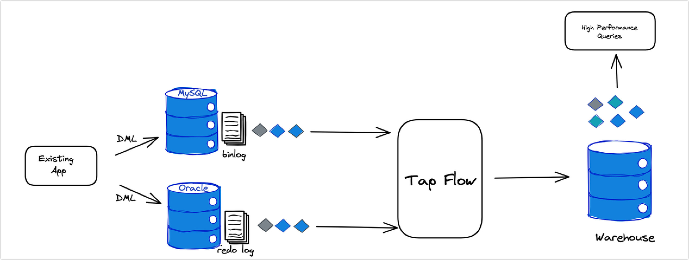

# TapFlow 介绍

import Content from '../reuse-content/_enterprise-and-cloud-features.md';

<Content />

**TapFlow** 是一个基于[变更数据捕获](../introduction/change-data-capture-mechanism.md)（CDC）技术的的流式数据处理的开发框架。除了通过[图形化界面](../user-guide/data-development/create-task.md)使用 TapData 产品外，您还可以通过 TapFlow 提供的丰富 API 和工具，快速实现同构或异构数据源的实时处理任务，满足灵活、自动化的数据集成和流式处理场景。

## 工作原理

TapFlow 的数据处理流程主要包括以下步骤：

- **数据采集**：通过 Tap CDC 连接并监控数据源中的更新事件（如新增、更新、删除操作），并将其转化为数据流。
- **数据流处理**：支持用户使用 API 或图形化界面对数据流进行实时处理，包括数据的合并、清洗、转换等复杂操作。
- **数据存储或输出**：将处理后的数据流保存到物化视图中，以支持快速查询和应用服务；或者直接将数据流发送至下游数据库或消息队列（如 Kafka）中，实现数据的快速传递。

## 核心特性

* **丰富数据源支持**：可快速连接常见关系型数据库（如 Oracle、DB2、MySQL）、非关系型数据库（如 MongoDB），以及消息队列（如 Kafka）。
* **高性能实时处理**：通过 CDC 实现数据源的实时更新监控，支持高并发数据处理，每秒高达数十万事件，提供毫秒级延迟的高吞吐读取能力。
* **灵活部署**：支持云端、私有化部署以及混合部署，满足不同安全性和成本需求。
* **简单易用**：仅需几行代码即可完成任务配置，支持在数据流中加入 Javascript 和 Python 自定义函数（UDF），实现灵活的业务处理逻辑。

## 典型应用场景

**TapFlow** 作为 TapData 的管理工具，通过 API 和命令行方式轻松管理数据同步任务，特别适用于以下场景中的实时数据更新：

- **金融交易系统中的余额更新**
  TapFlow 可实现交易完成后的账户余额实时更新，使用户在操作后立即看到最新的账户状态，满足高一致性需求。
- **库存管理系统中的实时库存**
  电商平台使用 TapFlow 进行跨平台库存更新管理，确保每次销售或退货后系统中展示的库存信息保持最新，避免超卖情况。
- **实时监控和告警系统**
  在 IT 和生产监控系统中，TapFlow 及时同步监控指标数据，确保系统能够基于最新数据做出告警判断，便于快速响应异常情况。
- **CRM 系统中的客户实时状态**
  使用 TapFlow 实时更新 CRM 中的客户互动记录和订单状态，业务人员可以根据最新客户信息快速决策和响应。
- **推荐系统中的用户行为更新**
  电商和内容平台的推荐系统利用 TapFlow 处理用户的实时行为数据，动态生成个性化推荐内容，确保推荐结果始终反映用户最新的兴趣和偏好。
