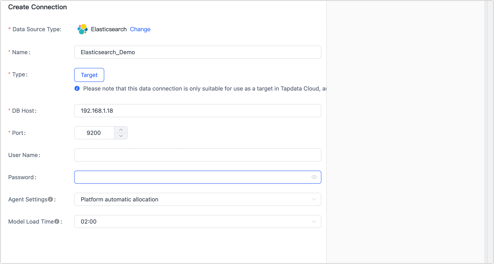

# Elasticsearch

Elasticsearch is a distributed, RESTful search and analytics engine capable of addressing a growing number of use cases.

TapData Cloud supports Elasticsearch as a target data source to help you quickly build data pipelines for scenarios such as log data write analytics, content management, and search analytics.  This article provides a comprehensive guide on how to add Elasticsearch to TapData Cloud.

## Supported Versions

Elasticsearch 7.6

## Connect to Elasticsearch

1. Log in to TapData Platform.

2. In the left navigation panel, click **Connections**.

3. On the right side of the page, click **Create**.

4. In the pop-up dialog box, search for and select **Elasticsearch**.

5. Fill in the connection information for Elasticsearch on the redirected page, following the instructions provided below.

   

   * **Name**: Fill in a unique name that has business significance.
   * **Type**: Currently only supported as a Target.
   * **DB Host**: Fill in the Elasticsearch connection address.
   * **Port**: Fill in the service port for Elasticsearch, for example **9200**.
   * **User Name**, **Password**: Fill in the username and password for Elasticsearch separately. If authentication is not enabled, you can leave it blank.
   * **Agent settings**: Defaults to **Platform automatic allocation**, you can also manually specify an agent.
   * **Model load time**: When the number of models in the data source is less than 10,000, the model information is refreshed every hour; if the model data exceeds 10,000, the model information is refreshed every day at the time you specify.

6. Click **Test Connection**, and when passed, click **Save**.

   :::tip

   If the connection test fails, follow the prompts on the page to fix it.

   :::

